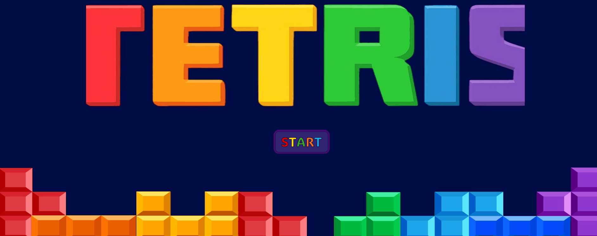

# Tetris Excel VBA Engine 

A fully functional, high-performance Tetris game built entirely within Microsoft Excel using VBA (Visual Basic for Applications). This project demonstrates that Excel can be used as a real-time game engine by leveraging low-level Windows APIs and dynamic UI generation.

  

##  Key Technical Features
* **Real-time Input handling:** Uses `GetAsyncKeyState` (Windows API) for lag-free, responsive controls.
* **Dynamic UI Generation:** Automatically builds a 200-cell game board using `MSForms.Label` objects via code.
* **Advanced Physics:** Custom collision detection system based on 4D arrays for tetromino rotations.
* **Persistent Leaderboard:** Local database with a built-in Bubble Sort algorithm for high-score management.

## Collaboration & Roles
This project was co-created as part of a University assignment for "Excel Applications in Business with VBA" course.

* **[Bogna Błaszak]**: 
    * Core Engine Development (Physics, Rotations, Collision Logic).
    * System Architecture Design & Refactoring.
    * Windows API Integration.
* **[Karolina Kielak]**: 
    * UI/UX Design (Canva-based visuals) & UserForms implementation.
    * Performance Optimization & Game State Management (Pause, Hard Drop).
    * Ranking System & Data Persistence.

## Project Structure
* `/src` - Full source code exported from VBA (Modules, Class Modules, and UserForms).
* `/assets` - Visual assets and project screenshots.
* `Tetris_Excel_VBA.xlsm` - The main executable Excel file.
* `documentation.pdf` - Technical documentation.

## How to Run
1. Download the `Tetris_Excel_VBA.xlsm` file.
2. Open in Microsoft Excel (Windows version recommended for WinAPI support).
3. **Enable Macros** when prompted.
4. Click "Start Game" and enjoy!

##  Controls
* **Arrow Left/Right** - Move Piece
* **Arrow Up** - Rotate
* **Arrow Down** - Soft Drop
* **Spacebar** - Hard Drop (Instant)
* **P** - Pause Game
